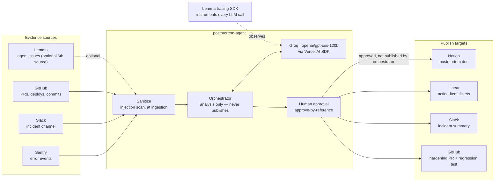
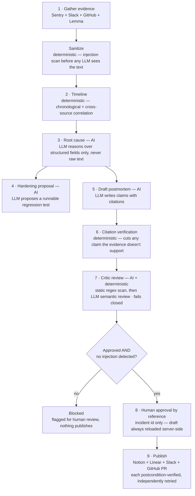

# postmortem-agent

An AI incident postmortem agent, built for the [Multi-App AI Agent Hackathon](https://multiappagenthackathon.com/) (hosted by Lemma + Comma Capital, judged with Arga Labs).

## The problem

When an incident happens, the story of *what went wrong* is scattered across three or four different tools — an error in Sentry, a conversation in Slack, a deploy in GitHub — and someone has to manually stitch that into a timeline, figure out the root cause, and write it up before anyone forgets what actually happened. That usually takes hours someone doesn't have, so postmortems get skipped, or written thin, or written wrong.

The naive fix — "pipe all the logs into an LLM and ask for a postmortem" — trades one problem for a worse one: an unverified, possibly hallucinated incident report that *sounds* authoritative. That's not a hypothetical risk, it's the exact failure category [Lemma](https://www.uselemma.ai/) exists to catch in AI agents, and the exact discipline [Arga Labs](https://docs.argalabs.com/) enforces before code ships: **don't trust an agent's output just because it's confident.**

## What this agent does about it

It gathers evidence, reconstructs the timeline, identifies the root cause, and writes a fully-cited postmortem — but every claim is mechanically checked against the evidence it cites before a human ever sees it, and the reasoning stages are structurally prevented from ever reading raw, untrusted evidence text. It doesn't just describe a fix, either — it proposes a regression test and opens it as a real, reviewable pull request.

1. **Gathers evidence** from Sentry, Slack, and GitHub (Lemma optional as a 6th source, for when the incident is itself an AI agent failure) — sanitizing every raw string for prompt injection *at ingestion*, before any of it reaches a reasoning step
2. **Reconstructs the timeline** and identifies **root cause**, reasoning only over structured fields (never raw evidence text) so an injection that slips past sanitization still can't reach the model
3. **Proposes a hardening fix** — a real, runnable regression test targeting the exact failure mode, not a bullet point
4. **Mechanically verifies every claim** against the evidence that's cited for it — unsupported claims are cut, not published
5. **A Critic reviews the draft** (static regex scan + LLM semantic review, fails closed) before anything is shown to a human
6. **A human approves by reference** (an incident id, never a client-supplied draft) — only then does it publish: a Notion postmortem, Linear action-item tickets, a Slack summary, and the hardening PR

Every publish step is postcondition-verified (a write returning 200 is never trusted as proof it landed) and independently retried, so one failing target never blocks the others.

## Architecture — how the integrations connect



Every box above is a real, live-verified integration (direct REST/GraphQL calls, no SDKs beyond Lemma's own tracing client) — see [`notes/05-hackathon-playbook.md`](notes/05-hackathon-playbook.md) for the account each one was tested against. **Arga Labs is deliberately not in this diagram** — see [On Arga Labs](#on-arga-labs) below for why, and what the actual alignment is instead.

## Agent pipeline — what's AI and what's deterministic



Steps 3, 4, 5, and half of 7 are LLM calls (Groq `openai/gpt-oss-120b`); everything else — sanitization, timeline correlation, citation verification, the static half of the critic, retries, and postcondition checks — is plain deterministic code. That split is the actual reliability story: the LLM proposes, deterministic code disposes.

## Install and run it

**Prerequisites:** Node.js 20+, and accounts/tokens for whichever integrations you want live (see below — the seeded demo incident works with none of them beyond Groq).

```bash
git clone https://github.com/prats-2311/postmortem-agent.git
cd postmortem-agent
npm install
cp .env.example .env
```

Fill in `.env`:

| Variable | Where to get it | Required? |
|---|---|---|
| `GROQ_API_KEY`, `GROQ_MODEL` | [console.groq.com/keys](https://console.groq.com/keys) | Yes — the agent's LLM |
| `LEMMA_API_KEY`, `LEMMA_PROJECT_ID` | [app.uselemma.ai](https://app.uselemma.ai) settings | Yes — traces the agent's own LLM calls |
| `SENTRY_AUTH_TOKEN`, `SENTRY_ORG_SLUG`, `SENTRY_PROJECT_SLUG` | Sentry org settings → Auth Tokens | Only for live Sentry evidence |
| `SLACK_BOT_TOKEN`, `SLACK_INCIDENT_CHANNEL_ID` | Slack app OAuth token | Only for live Slack evidence / posting |
| `GITHUB_TOKEN`, `GITHUB_REPO` | GitHub → Settings → Developer settings → PATs | Only for live GitHub evidence / opening the hardening PR |
| `NOTION_API_KEY`, `NOTION_PARENT_PAGE_ID` | Notion integration settings | Only to publish the postmortem doc |
| `LINEAR_API_KEY`, `LINEAR_TEAM_ID` | Linear → Settings → API | Only to file action-item tickets |

Then:

```bash
npm run typecheck                # tsc --noEmit
npm test                         # 79 tests

npm run postmortem -- INC-142    # runs the full analysis pipeline (stages 1–7 above) — no writes happen here
npm run approve -- INC-142       # human approval → real publishes to Notion, Linear, Slack, and the hardening PR

npm run eval                     # scored eval harness against seeded fixtures (timeline recall, citation coverage, hallucination rate, injection quarantine)
```

`npm run postmortem` currently runs against the seeded fixture at `src/evals/fixtures/INC-142/evidence.json` — built from real evidence pulled through the same fetchers in `src/evidence/`, so the incident is real content, deterministically reproducible for grading. Each fetcher (`sentry.ts`, `slack.ts`, `github.ts`, `lemma.ts`) is independently live-tested against a real account (see its test file) and ready to be wired behind a `--live` flag as a fast-follow.

## Why this, not just an LLM wrapper

The reliability design is deliberate, not decorative — see [`notes/05-hackathon-playbook.md`](notes/05-hackathon-playbook.md) for the full build log, including every bug this project's own testing caught before the demo:

- A fail-closed verdict schema (ported from a documented bug in a prior submission's Critic — see [`notes/07`](notes/07-voyageblack-critic-analysis.md))
- A live-discovered deadlock where the Critic's "approved" and "requires human review" fields were conflated, fixed by clarifying the prompt — not by weakening the gate
- Every evidence fetcher and publisher live-verified against a real account before being trusted, not just unit-tested against mocks

### On Arga Labs

We looked into whether Arga's platform (Twins, Scenarios, browser Test Runs — see their [API reference](https://docs.argalabs.com/api-reference.md)) could be integrated directly, rather than just cited. Honest conclusion: no natural fit. Arga's entire surface is pre-production testing — ephemeral simulated services, seeded scenarios, browser automation against a reachable URL. This agent's job is the opposite: investigating *real* incidents with *real* evidence after the fact. Rather than force a hollow integration, the genuine alignment is architectural: both projects treat "safe, verifiable evidence before an agent acts" as non-negotiable — Arga enforces it before code ships, this agent enforces it before a conclusion is published.

## Project structure

```
src/
├── schemas.ts              Zod schemas — see the fail-closed CriticVerdict design
├── sanitize.ts              Injection scanning, runs at evidence ingestion
├── evidence/                Sentry, Slack, GitHub, Lemma fetchers
├── pipeline/                timeline, correlate, rootcause, report, hardening
├── verify/                  citations (mechanical + LLM), critic (2-layer)
├── publish/                 notion, linear, slack-post, github-pr
├── orchestrator.ts          runs analysis; never publishes
├── approve.ts               approve-by-reference; the only path to a real write
└── evals/                   scored fixture-based eval harness
```

Full research and build log in [`notes/`](notes/).
